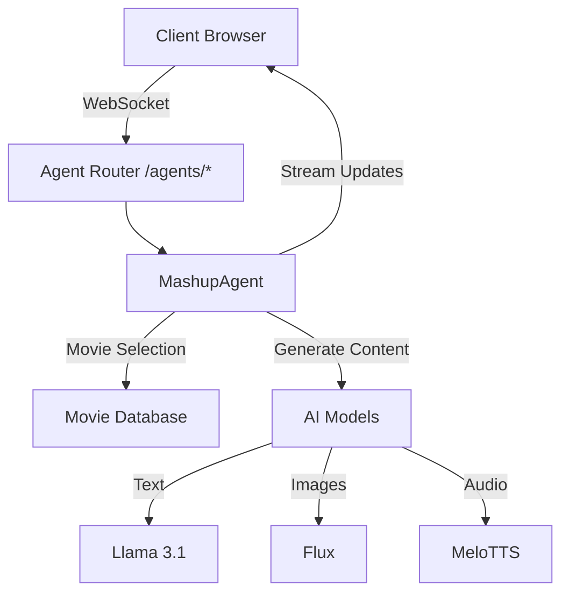
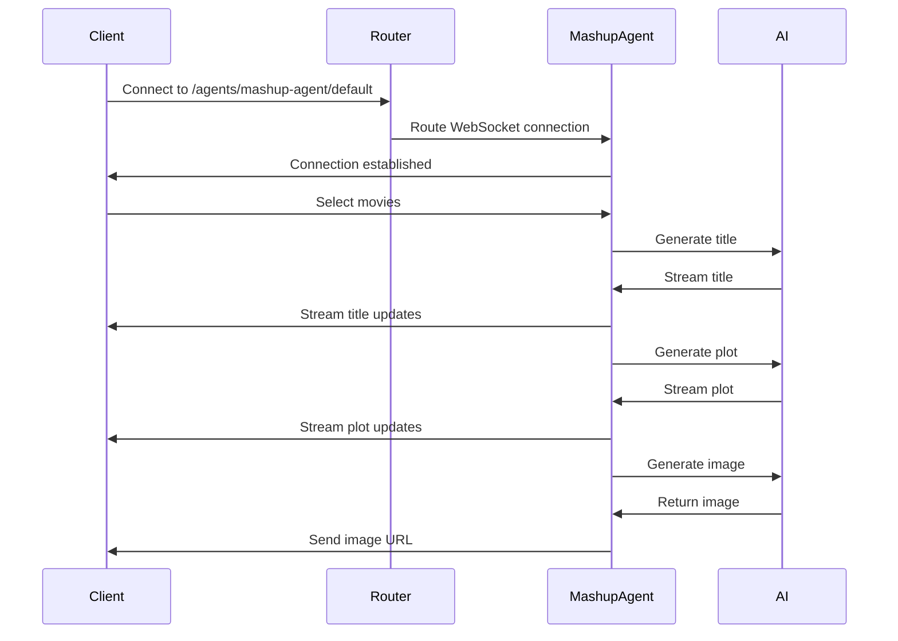
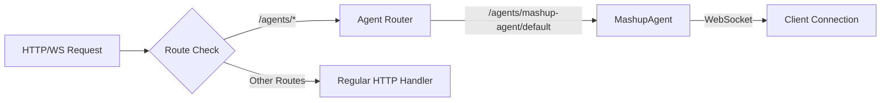
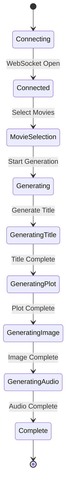

# AI Movie Mashup

> Griffin: So it's a psychic, political, thriller comedy with a heart.

> Writer: With a heart, not unlike Ghost meets Manchurian Candidate.

**From ["The Player"](<https://en.wikipedia.org/wiki/The_Player_(1992*film)s>) - a 1992 American satirical black comedy mystery film directed by Robert Altman and written by Michael Tolkin.\***

---

AI Movie Mashup is a fun RedwoodSDK experiment that combines elements (aka "mashes up") from two different movies to create unique, AI-generated movie concepts. It uses artificial intelligence to generate new movie ideas, complete with titles, taglines, plots, posters, and audio of the plot.

## Screenshots


-- old screenshots. new ones coming soon with the agent streaming.

## Video Demo

I recorded a video demo of the app that shows the main features in action.

[👀 Watch the Demo](https://screen.studio/share/JRN2137W)

-- Old demo. a little out of date. new one coming soon with the agent streaming.

## Important !!!

This app is not deployed. It's a work in progress.

You should run locally with `pnpm dev` and check it out.

I would not deploy until I can ensure rate limiting is in place to prevent abuse and runaway AI charges.

The `api` is open currently and thus accessible to all and open to potential high AI costs.

If you choose to deploy, your do so knowing that you are responsible for the cost of the AI usage.

## Features

- **Movie Selection**: Choose two movies to combine into a unique mashup
- **AI-Generated Content**: Automatically generates:
  - Creative movie titles
  - Engaging taglines
  - Detailed plot summaries
  - Custom movie posters
  - Audio text to speech of the mashup plot
- **User Management**: Secure authentication and user profiles. Not yet implemented.
- **Mashup Gallery**: Browse and explore previously created mashups
- **Asynchronous Processing**: Asynchronous processing of mashup requests with Cloudflare Queues
- **AI Agents**: Real-time updates and streaming of generated content with WebSockets

## Architecture Diagrams

### Overall Agent Architecture


### WebSocket Communication Flow


### Agent Routing Flow


### Mashup Generation Process


## Technology Stack

- **RedwoodSDK**: https://www.rwsdk.com
  - React with TypeScript, React Server Components, Cloudflare Workers
- **AI**: Cloudflare AIs
- **AI Gateway**: Cloudflare AI Gateway for logs, caching, rate limiting, etc.
- **Database**: Cloudflare D1 with Prisma ORM
- **Queue**: Cloudflare Queues
- **Image Generation**: Cloudflare R2 and D1
- **Storage**: Cloudflare R2
- **Authentication**: WebAuthn for secure user authentication
- **Styling**: Tailwind CSS
- **Build Tools**: Vite

## Database Schema and Data Models

### Movies

The `Movie` model represents individual movies in the system:

- `id`: Unique identifier for the movie
- `createdAt`: Timestamp of when the movie was added
- `title`: Movie title
- `photo`: URL/path to movie poster image
- `overview`: Movie description/synopsis
- `releaseDate`: Original release date of the movie
- Relations:
  - Connected to `Mashup` model as either movie1 or movie2

### Users

The `User` model handles user authentication and management:

- `id`: UUID-based unique identifier
- `username`: Unique username for the user
- `createdAt`: Account creation timestamp
- Relations:
  - Has associated `Credential` records for WebAuthn authentication

### Credentials

The `Credential` model manages WebAuthn authentication:

- `id`: UUID-based identifier
- `userId`: Associated user ID
- `credentialId`: Unique WebAuthn credential identifier
- `publicKey`: Stored public key for authentication
- `counter`: Authentication counter
- `createdAt`: Credential creation timestamp

### Mashups

The `Mashup` model stores generated movie combinations:

- `id`: CUID-based unique identifier
- `createdAt`: Timestamp of mashup creation
- `movie1Id`: First source movie ID
- `movie2Id`: Second source movie ID
- `title`: AI-generated mashup title
- `tagline`: AI-generated tagline
- `plot`: AI-generated plot summary
- `imageKey`: Reference to generated poster image in storage
- `imageDescription`: AI-generated image prompt/description
- `audioKey`: Reference to generated audio narration
- `status`: Processing status (PENDING, COMPLETED, FAILED)
- Relations:
  - Links to two source `Movie` records

## AI Models

The application leverages several Cloudflare AI models for different functionalities:

- **Text Generation**: `@cf/meta/llama-3.1-8b-instruct`

  - Used for generating movie titles, taglines, plots, and poster descriptions
  - Based on Meta's Llama 3.1 8B parameter model

- **Image Generation**: `@cf/black-forest-labs/flux-1-schnell`

  - Creates unique movie posters based on AI-generated descriptions
  - Powered by Black Forest Labs' Flux model

- **Text-to-Speech**: `@cf/myshell-ai/melotts`
  - Generates audio descriptions of the mashup movies
  - Uses MyShell AI's MeloTTS model for natural-sounding narration

## AI Agents

The application uses an agent-based architecture to handle the movie mashup generation process. The main agent, `MashupAgent`, orchestrates the entire workflow using WebSocket connections for real-time communication.

### MashupAgent

The `MashupAgent` is a stateful agent that:

- Maintains WebSocket connections with clients
- Processes movie selection requests
- Coordinates the generation of mashup content
- Handles error cases and connection lifecycle
- Manages the streaming of generated content back to clients

### Agent UI Components

The agent interface consists of several React components:

- **MovieSelector**: Allows users to choose two movies for the mashup
- **GenerateButton**: Triggers the mashup generation process
- **MashupResults**: Displays the generated content including:
  - Title
  - Tagline
  - Plot
  - Generated poster image
  - Audio narration
- **DebugMessages**: Optional component for monitoring WebSocket communication

### Real-time Updates

The agent system provides real-time updates as content is generated:

- Streaming text updates for title, tagline, and plot
- Progressive image generation
- Audio file generation
- Error handling and status updates

### WebSocket Communication

The agent uses WebSocket connections to:

- Maintain persistent connections with clients
- Stream generated content in real-time
- Handle connection errors and cleanup
- Manage the generation workflow state

## Agent Routing

The agent is routed via the `/agents/*` route.

This is a Cloudflare specific routing mechanism that automatically routes HTTP requests and/or WebSocket connections to `/agents/:agent/:name`.

It allows you to connect React apps directly to Agents using the `useAgent` hook for websockets updates.

```ts
route("/*", async ({ request }: RequestInfo) => {
    // Automatically routes HTTP requests and/or WebSocket connections to /agents/:agent/:name
    // Best for: connecting React apps directly to Agents using useAgent from agents/react
    // The MashupAgent is defined in the MashupAgent.ts file
    // Wrangler durable_objects config defines the agent name as MASHUP_AGENT and the class name as MashupAgent
    // So /agents/mashup-agent/default will route to the MashupAgent when an agent client
    // uses the `useAgent` hook for websockets updates

    return (
      (await routeAgentRequest(request, env)) ||
      Response.json({ msg: "no agent here" }, { status: 404 })
    );
  }),
```

## Getting Started

### Prerequisites

- Node.js (Latest LTS version)
- pnpm package manager

### Cloudflare Services

- Cloudflare account (for deployment)
- Cloudflare R2 bucket (dev or prod)
- Cloudflare D1 database (dev or prod)
- Cloudflare Queues (dev or prod)
- Cloudflare AI Gateway (setup via Cloudflare dashboard)
- Cloudflare AI (setup via Cloudflare dashboard)

### Installation

1. Clone the repository:

```bash
git clone [repository-url]
cd movie-mashup
```

2. Install dependencies:

```bash
pnpm install
```

3. Set up environment variables:

```bash
cp .env.example .env
```

Edit the `.env` file with your configuration values.

4. Initialize the Development Environment

```bash
pnpm dev:init
```

This will:

* Initializing development environment...
* Running migrations...
* Seeding database...

It is imporant as it will ensurwe all rhe Worker bindings from `wrangler.jsonc` are setup.

5. Initialize the database:

```bash
pnpm migrate:dev
```

Note: Already done, but if want to redo.

6. Seed the database with movies:

```bash
pnpm seed
```
Note: Already done, but if want to redo.

7. Start the development server:

```bash
pnpm dev
```

### Development

- `pnpm dev` - Start the development server
- `pnpm build` - Build the application
- `pnpm migrate:dev` - Run database migrations locally
- `pnpm migrate:prd` - Run database migrations in production
- `pnpm format` - Format code using Prettier

### Deployment

To deploy to Cloudflare:

```bash
pnpm release
```

## Project Structure

- `/src/app` - Main application components
- `/src/app/pages/mashups` - Movie mashup functionality
- `/src/app/pages/agents` - Agent functionality
- `/src/app/api` - API routes when returning JSON, images, audio, etc. (ie, not JSX)
- `/src/app/agents` - Where the agent lives and its routing
- `/src/session` - User session management
- `/prisma` - Database schema and migrations
- `/migrations` - Database migration files
- `/src/scripts` - Scripts for data seeding and migrations

## Contributing

1. Fork the repository
2. Create your feature branch (`git checkout -b feature/amazing-feature`)
3. Commit your changes (`git commit -m 'Add some amazing feature'`)
4. Push to the branch (`git push origin feature/amazing-feature`)
5. Open a Pull Request

## License

This project is not licensed.
