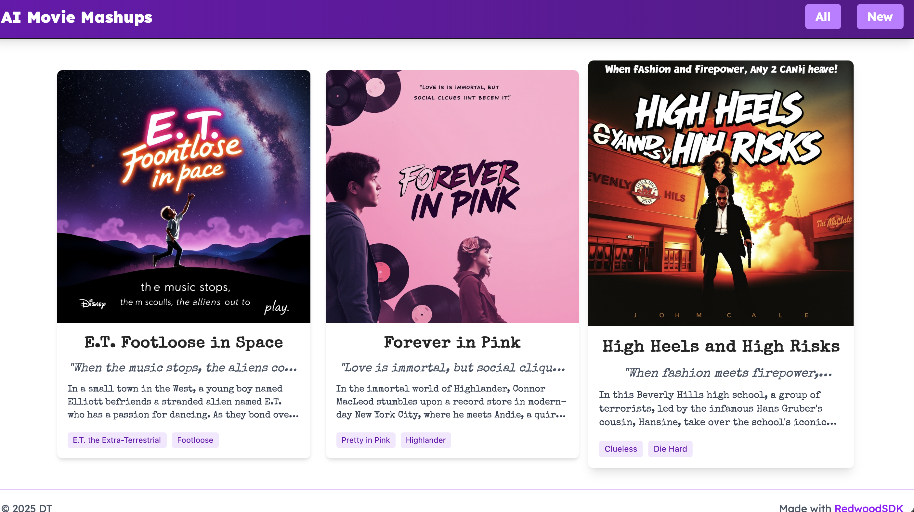
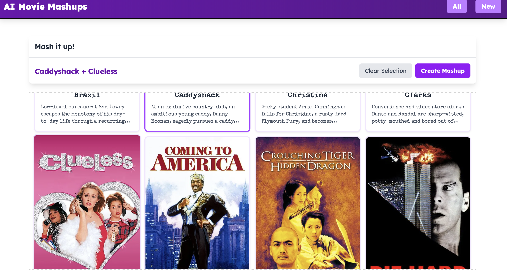
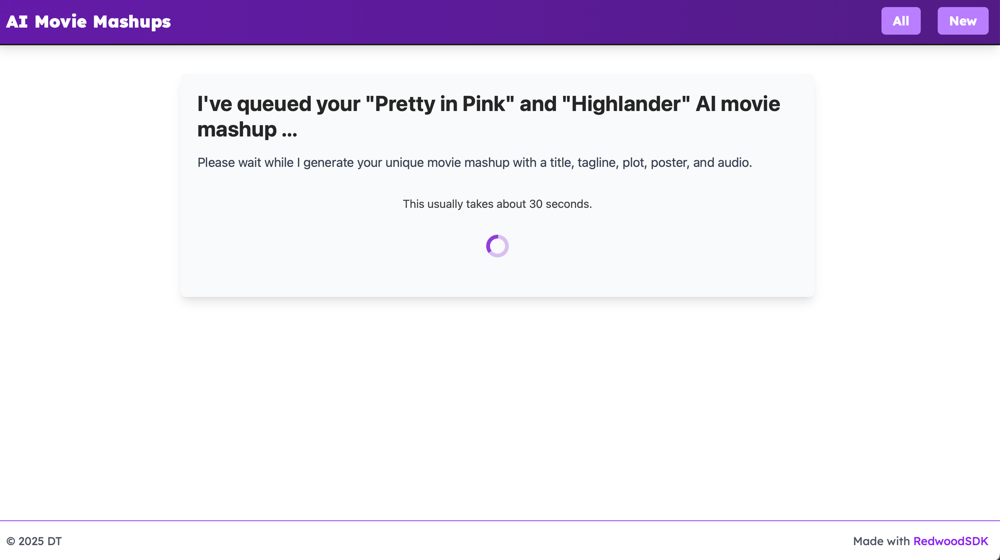
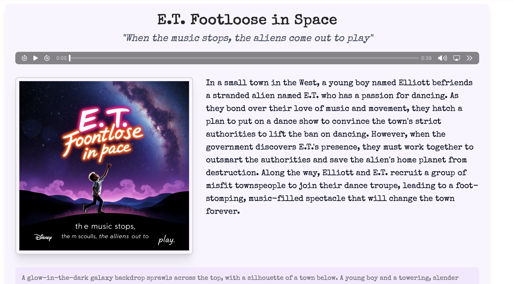
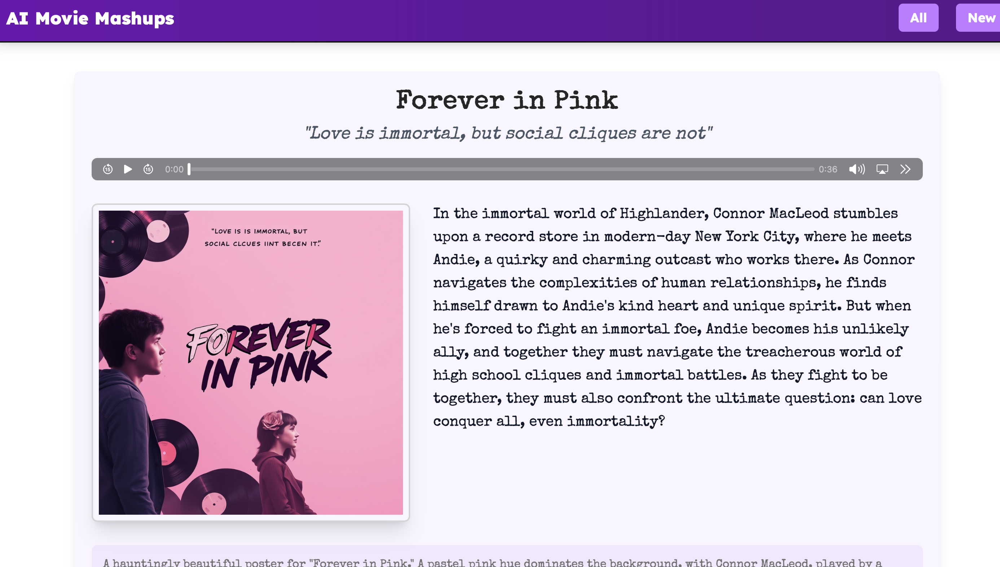
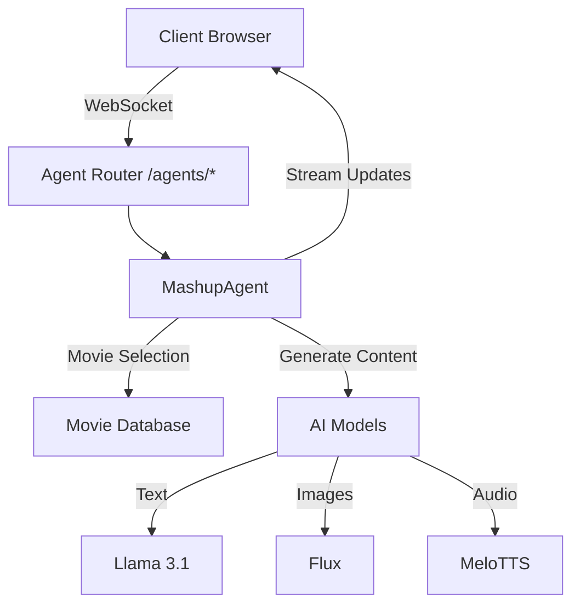
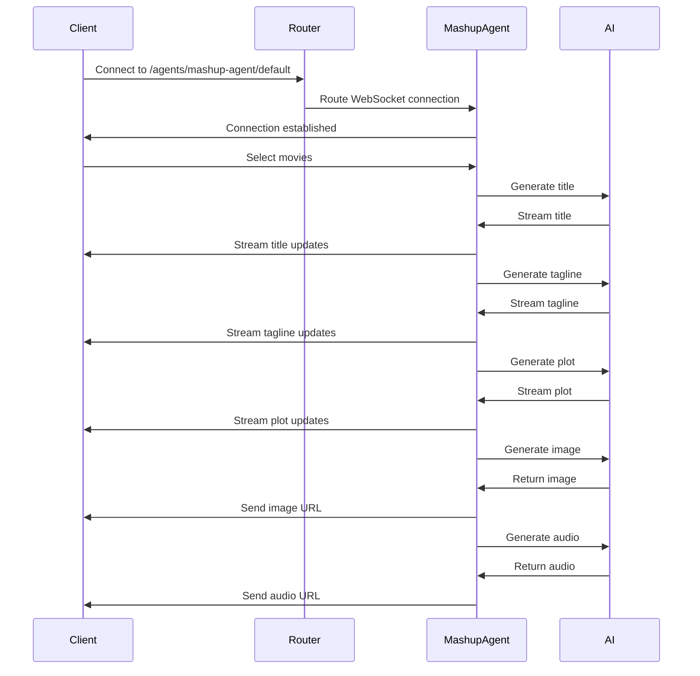
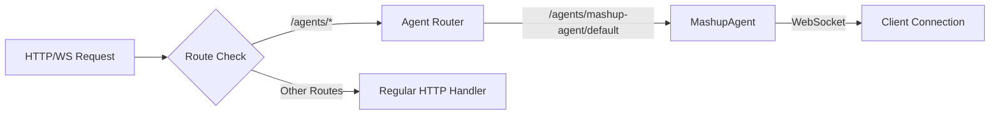
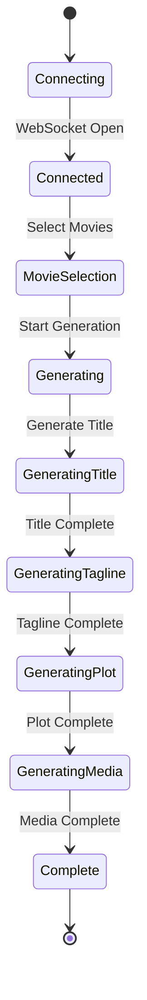

# AI Movie Mashup

> Griffin: So it's a psychic, political, thriller comedy with a heart.

> Writer: With a heart, not unlike Ghost meets Manchurian Candidate.

**From ["The Player"](<https://en.wikipedia.org/wiki/The_Player_(1992*film)s>) - a 1992 American satirical black comedy mystery film directed by Robert Altman and written by Michael Tolkin.\***

---

AI Movie Mashup is a fun RedwoodSDK experiment that combines elements (aka "mashes up") from two different movies to create unique, AI-generated movie concepts. It uses artificial intelligence to generate new movie ideas, complete with titles, taglines, plots, posters, and audio of the plot.

## Screenshots







-- old screenshots. new ones coming soon with the agent streaming.

## Video Demo

I recorded a video demo of the app that shows the main features in action.

[👀 Watch the Demo](https://screen.studio/share/JRN2137W)

-- Old demo. a little out of date. new one coming soon with the agent streaming.

## Important !!!

This app is not deployed. It's a work in progress.

You should run locally with `pnpm dev` and check it out.

I would not deploy until I can ensure rate limiting is in place to prevent abuse and runaway AI charges.

The `api` is open currently and thus accessible to all and open so you will want to use the [AI Gateway ](https://developers.cloudflare.com/ai-gateway/) to both cache and limit the usage.

If you choose to deploy, your do so knowing that you are responsible for the cost of the AI usage.

## Features

- **Movie Selection**: Choose two movies to combine into a unique mashup
- **AI Agents**: Real-time updates and streaming of generated content with WebSockets
- **AI-Generated Content**: Automatically generates:
  - Creative movie titles
  - Engaging taglines
  - Detailed plot summaries
  - Custom movie posters
  - Audio text to speech of the mashup plot
- **Presets**: Pre-defined movie combinations for quick mashup generation
  - Browse curated movie pairings
  - Mark favorites for easy access
  - "Lucky" random movie combination
- **User Management**: Secure authentication and user profiles. Not yet implemented.
- **Mashup Gallery**: Browse and explore previously created mashups

## Project Structure

- `/src/app` - Main application components
- `/src/app/pages/mashups` - Movie mashup functionality
  - `components/` - UI components for mashup creation and display
  - `functions.ts` - Server-side functions
- `/src/app/pages/presets` - Preset functionality
  - `components/` - UI components for preset display
    - `PresetLink.tsx` - Link component for preset navigation
    - `LuckyLink.tsx` - Random movie combination link
    - `PresetMashups.tsx` - Preset grid display
  - `functions.ts` - Server-side functions for preset management
  - `types.ts` - TypeScript type definitions
- `/src/app/agents` - Agent implementation
  - `MashupAgent.ts` - Main agent class
  - `functions/` - Agent helper functions
    - `mashupMovies.ts` - Core mashup generation logic
    - `generateTitle.ts` - Title generation
    - `generateTagline.ts` - Tagline generation
    - `generatePlot.ts` - Plot generation
    - `generatePoster.ts` - Poster image generation
    - `generateAudioContent.ts` - Audio generation
    - `helpers.ts` - Utility functions for streaming and data conversion
- `/prisma` - Database schema and migrations
- `/src/scripts` - Scripts for data seeding and migrations
  - `presets.ts` - Predefined movie combinations for seeding
  - `movies.ts` - Movies for seeding

## Application Routes

The application uses several request handlers to manage different aspects of the system:

### Main Application Routes

- `/` - Home page (redirects to mashups)
- `/presets` - Presets page
- `/protected` - Protected route (requires authentication)

### Mashup Routes

- `/mashups` - Main mashups page
- `/mashups/page/:page` - Paginated mashups
- `/mashups/view/:id` - View a specific mashup
- `/mashups/new` - Create a new mashup
- `/mashups/new/:firstMovieId` - Create mashup with first movie selected
- `/mashups/new/:firstMovieId/:secondMovieId` - Create mashup with both movies selected
- `/mashups/random-mashup` - Generate a random movie combination mashup

### API Routes

- `/api/mashups/:id` - Get mashup details by ID
- `/api/poster/:key` - Get poster image by key
- `/api/mashups/:id/poster` - Get poster for a specific mashup
- `/api/audio/:key` - Get audio file by key
- `/api/mashups/:id/audio` - Get audio for a specific mashup

### Agent Routes

- `/agents/*` - WebSocket routes for agent communication
  - Automatically routes to appropriate agent based on path
  - Used for real-time updates and streaming content generation
  - Main agent path: `/agents/mashup-agent/default`

### User Routes

- `/user/*` - User authentication and management routes
  - Includes login, registration, and profile management

### Route Configuration

The application uses several route configuration files:

1. `worker.tsx` - Main application router setup
2. `routes.ts` files in various directories:
   - `src/app/api/routes.ts` - API endpoints
   - `src/app/agents/routes.ts` - Agent WebSocket routes
   - `src/app/pages/mashups/routes.ts` - Mashup page routes
3. `links.ts` - Defines all available routes for client-side navigation

## Architecture Diagrams

### Overall Agent Architecture



### WebSocket Communication Flow



### Agent Routing Flow



### Mashup Generation Process



## Technology Stack

- **RedwoodSDK**: https://www.rwsdk.com
  - React with TypeScript, React Server Components, Cloudflare Workers
- **AI**: [Cloudflare Workers AI](https://developers.cloudflare.com/workers-ai/)
  - Text Generation: `@cf/meta/llama-3.1-8b-instruct`
  - Image Generation: `@cf/black-forest-labs/flux-1-schnell`
  - Text-to-Speech: `@cf/myshell-ai/melotts`
- **AI Gateway**: [Cloudflare AI Gateway](https://developers.cloudflare.com/ai-gateway/) for logs, caching, rate limiting
- **Database**: [Cloudflare D1](https://developers.cloudflare.com/d1/) with Prisma ORM
- **Storage**: [Cloudflare R2](https://developers.cloudflare.com/r2/) for images and audio
- **Styling**: [Tailwind CSS](https://tailwindcss.com/)
- **Build Tools**: [Vite](https://vitejs.dev/)

## Database Schema and Data Models

### Movies

The `Movie` model represents individual movies in the system:

- `id`: Unique identifier for the movie
- `createdAt`: Timestamp of when the movie was added
- `title`: Movie title
- `photo`: URL/path to movie poster image
- `overview`: Movie description/synopsis
- `releaseDate`: Original release date of the movie
- Relations:
  - Connected to `Mashup` model as either movie1 or movie2

### Users

The `User` model handles user authentication and management:

- `id`: UUID-based unique identifier
- `username`: Unique username for the user
- `createdAt`: Account creation timestamp
- Relations:
  - Has associated `Credential` records for WebAuthn authentication

### Credentials

The `Credential` model manages WebAuthn authentication:

- `id`: UUID-based identifier
- `userId`: Associated user ID
- `credentialId`: Unique WebAuthn credential identifier
- `publicKey`: Stored public key for authentication
- `counter`: Authentication counter
- `createdAt`: Credential creation timestamp

### Mashups

The `Mashup` model stores generated movie combinations:

- `id`: CUID-based unique identifier
- `createdAt`: Timestamp of mashup creation
- `movie1Id`: First source movie ID
- `movie2Id`: Second source movie ID
- `title`: AI-generated mashup title
- `tagline`: AI-generated tagline
- `plot`: AI-generated plot summary
- `imageKey`: Reference to generated poster image in storage
- `imageDescription`: AI-generated image prompt/description
- `audioKey`: Reference to generated audio narration
- `status`: Processing status (PENDING, COMPLETED, FAILED)
- Relations:
  - Links to two source `Movie` records

### Presets

The `Preset` model represents pre-defined movie combinations:

- `id`: CUID-based unique identifier
- `createdAt`: Timestamp of preset creation
- `updatedAt`: Timestamp of last update
- `movie1Id`: First movie ID
- `movie2Id`: Second movie ID
- `isFavorite`: Boolean flag for favorite presets
- Relations:
  - Links to two source `Movie` records via `movie1` and `movie2`
- Constraints:
  - Unique combination of `movie1Id` and `movie2Id`

## AI Models

The application leverages several Cloudflare AI models for different functionalities:

- **Text Generation**: `@cf/meta/llama-3.2-3b-instruct`

  - Used for generating movie titles, taglines, plots, and poster descriptions
  - Based on Meta's Llama 3.1 8B parameter model
  - Utilizes the `streamAndReturnCompleteText` helper function from `helpers.ts` for real-time streaming

- **Image Generation**: `@cf/black-forest-labs/flux-1-schnell`

  - Creates unique movie posters based on AI-generated descriptions
  - Powered by Black Forest Labs' Flux model
  - Uses `base64ToBlob` helper function from `helpers.ts` for image data conversion

- **Text-to-Speech**: `@cf/myshell-ai/melotts`
  - Generates audio descriptions of the mashup movies
  - Uses MyShell AI's MeloTTS model for natural-sounding narration

### Helper Functions

The application uses several key helper functions from `helpers.ts`:

- `streamAndReturnCompleteText`: Handles real-time streaming of AI-generated text content

  - Manages WebSocket connections
  - Streams text chunks to clients
  - Returns complete generated text
  - Used for title, tagline, plot, and poster description generation

- `base64ToBlob`: Converts base64-encoded image data to binary blobs
  - Used for processing AI-generated images
  - Handles image data conversion for storage in R2

## AI Agents

The application uses a single `MashupAgent` to handle the entire movie mashup generation process. The agent maintains WebSocket connections with clients and orchestrates the generation of content in real-time.

### MashupAgent

The `MashupAgent` is a stateful agent that:

- Maintains WebSocket connections with clients
- Processes movie selection requests
- Coordinates the generation of mashup content in sequence:
  1. Title generation
  2. Tagline generation
  3. Plot generation
  4. Media generation (poster and audio)
- Handles error cases and connection lifecycle
- Manages the streaming of generated content back to clients

### Mashup Creator UI Components

The mashup creator interface consists of several React components:

- **MovieSelector**: Allows users to choose two movies for the mashup
- **GenerateButton**: Triggers the mashup generation process
- **MashupResults**: Displays the generated content including:
  - Title
  - Tagline
  - Plot
  - Generated poster image
  - Audio narration
- **DebugMessages**: Optional component for monitoring WebSocket communication

### Real-time Updates with useAgent

The Mashup Creator UI leverages the Cloudflare Agents SDK's `useAgent` hook to establish and maintain a WebSocket connection with the `MashupAgent`. This hook is crucial for:

1. **Connection Management**:

   - Automatically establishes a WebSocket connection to `/agents/mashup-agent/default`
   - Handles connection lifecycle (open, close, error)
   - Manages reconnection logic

2. **Real-time State Updates**:

   - Receives streaming updates for generated content:
     - Title chunks as they're generated
     - Tagline chunks as they're generated
     - Plot chunks as they're generated
     - Image and audio URLs when complete
   - Updates UI state in real-time using React state management

3. **Message Handling**:

   - Processes incoming WebSocket messages
   - Parses JSON data
   - Updates appropriate state variables based on message type
   - Handles error cases and connection issues

4. **Content Generation**:
   - Sends movie selection to the agent
   - Triggers the mashup generation process
   - Manages the generation state (loading, error, complete)

Example usage in the MashupCreator component:

```tsx
const agent = useAgent({
  agent: "mashup-agent",
  onMessage: (message) => {
    // Handle streaming updates
    if (data.title) updateStreamingState(setTitle, data.title);
    if (data.tagline) updateStreamingState(setTagline, data.tagline);
    if (data.plot) updateStreamingState(setPlot, data.plot);
    // ... handle other content types
  },
  onError: (error) => {
    // Handle connection errors
    setError("Connection error. Please try again.");
  },
  onClose: () => {
    // Handle connection closure
    setIsGenerating(false);
  },
});
```

The `useAgent` hook provides a seamless way to integrate real-time, streaming content generation into the React UI, making the mashup creation process feel immediate and interactive.

## Agent Routing

The agent is routed via the `/agents/*` route, which automatically routes WebSocket connections to the appropriate agent instance. The routing is handled by the RedwoodSDK's agent routing system.

```ts
route("/*", async ({ request }: RequestInfo) => {
    return (
      (await routeAgentRequest(request, env)) ||
      Response.json({ msg: "no agent here" }, { status: 404 })
    );
  }),
```

## Add New Movies

To add new movies to the system:

1. **Source Movies from TMDB**:

   - All movie data comes from [The Movie Database (TMDB)](https://www.themoviedb.org)
   - Each movie has a unique TMDB ID (e.g., "11-star-wars", "12-finding-nemo")

2. **Add to Movies Array**:
   In `src/scripts/movies.ts`, add a new movie object with the following structure:

   ```typescript
   {
     id: "tmdb-id",  // The TMDB ID
     title: "Movie Title",
     photo: "/path-to-poster.jpg",  // TMDB poster path
     overview: "Movie description/synopsis",
     releaseDate: "YYYY-MM-DD"  // Optional release date
   }
   ```

3. **Example**:
   ```typescript
   {
     id: "12345-movie-name",
     title: "New Movie",
     photo: "/new-poster.jpg",
     overview: "A new movie description...",
     releaseDate: "2024-01-01"
   }
   ```

## Add New Presets

To create new movie mashup presets:

1. **Create Preset Combinations**:
   In `src/scripts/presets.ts`, add a new preset object with the following structure:

   ```typescript
   {
     movie1Id: "tmdb-id-1",  // First movie's TMDB ID
     movie2Id: "tmdb-id-2",  // Second movie's TMDB ID
     isFavorite: false  // Optional: mark as favorite
   }
   ```

2. **Example**:
   ```typescript
   {
     movie1Id: "12345-movie-name",
     movie2Id: "67890-another-movie",
     isFavorite: true
   }
   ```

### Seeding the Database

After adding new movies and presets:

1. **Run the Seed Script**:
   ```bash
   pnpm seed
   ```

The `seed.ts` script will:

- Clear existing data
- Create a test user
- Add all movies from `movies.ts`
- Create presets from `presets.ts`

### Important Notes

1. **TMDB IDs**:

   - Always use the TMDB ID format (e.g., "12345-movie-name")
   - These IDs are used to fetch movie details and posters
   - Ensure the IDs exist in TMDB's database

2. **Preset Combinations**:

   - Both `movie1Id` and `movie2Id` must reference valid movie IDs
   - The combination of `movie1Id` and `movie2Id` must be unique
   - You can mark interesting combinations as favorites with `isFavorite: true`

3. **Data Validation**:
   - The seed script will validate the data
   - It ensures all referenced movies exist
   - It maintains data integrity in the database

## Getting Started

### Prerequisites

- Node.js (Latest LTS version)
- pnpm package manager

### Cloudflare Services

- Cloudflare account (for deployment)
- Cloudflare R2 bucket (dev or prod)
- Cloudflare D1 database (dev or prod)
- Cloudflare AI Gateway (setup via Cloudflare dashboard)
- Cloudflare AI (setup via Cloudflare dashboard)

### Installation

1. Clone the repository:

```bash
git clone [repository-url]
cd movie-mashup
```

2. Install dependencies:

```bash
pnpm install
```

3. Set up environment variables:

```bash
cp .env.example .env
```

Edit the `.env` file with your configuration values.

4. Initialize the Development Environment

```bash
pnpm dev:init
```

This will:

- Initializing development environment...
- Running migrations...
- Seeding database...

It is imporant as it will ensurwe all rhe Worker bindings from `wrangler.jsonc` are setup.

5. Initialize the database:

```bash
pnpm migrate:dev
```

Note: Already done, but if want to redo.

6. Seed the database with movies:

```bash
pnpm seed
```

Note: Already done, but if want to redo.

7. Start the development server:

```bash
pnpm dev
```

### Development

- `pnpm dev` - Start the development server
- `pnpm build` - Build the application
- `pnpm migrate:dev` - Run database migrations locally
- `pnpm migrate:prd` - Run database migrations in production
- `pnpm format` - Format code using Prettier

### Deployment

To deploy to Cloudflare:

```bash
pnpm release
```

Prerequisites:

- Have a Cloudflare account
- Have a Cloudflare R2 bucket
- Have a Cloudflare D1 database
- Have a Cloudflare AI Gateway
- Have a Cloudflare AI
- All properly configured in the Cloudflare dashboard and bound to the worker in the `wrangler.jsonc` file
- Paid accounts preferred due to the charges for the AI models, Gateway, and R2

#### Populate the Database

Use wrangler to populate the database with the data in the `data` folder.

Note: This is just for initial population in production. See the "--remote" flag below.

```bash
pnpm wrangler d1 execute movie-mashup-db --remote --file=./data/movies.sql
pnpm wrangler d1 execute movie-mashup-db --remote --file=./data/presets.sql
```

### Reset Mashups

Note: This executes a delete statement on the `Mashup` table in production. See the "--remote" flag below.

```bash
pnpm wrangler d1 execute movie-mashup-db --remote --command="DELETE FROM "Mashup";"
```

### Add a New Movie to Production

-- Note: This is just an example. You can add a new movie to the database by running the following command.
-- In development, you can add a new movie to the database with seeding.

```bash
pnpm wrangler d1 execute movie-mashup-db --remote --command="\
  INSERT INTO Movie (id, title, overview, releaseDate, photo) \
  VALUES ( \
    '12921-strange-brew', \
    'Strange Brew', \
    'Something is rotten at the Elsinore Brewery. Bob and Doug McKenzie (as seen on SCTV) help the orphan Pam regain the brewery founded by her recently-deceased father. But to do so, they must confront the suspicious Brewmeister Smith and two teams of vicious hockey players.', \
    '1983-08-26T00:00:00.000Z', \
    'xGycYCOSNCH9aAcvT51NeYyF5nK.jpg' \
  )"
```

### Add a New Preset to Production

-- Note: This is just an example. You can add a new preset to the database by running the following command.
-- In development, you can add a new preset to the database with seeding.

```bash
pnpm wrangler d1 execute movie-mashup-db --remote --command="\
  INSERT INTO Preset (id, createdAt, updatedAt, movie1Id, movie2Id, isFavorite) \
  VALUES ( \
    'cltxyz123abcdefghijklmnop', \
    '2025-04-13T02:46:24.197+00:00', \
    '2025-04-13T02:46:24.197+00:00', \
    '12921-strange-brew', \
    '11-star-wars', \
    false \
  )"
```

## Contributing

1. Fork the repository
2. Create your feature branch (`git checkout -b feature/amazing-feature`)
3. Commit your changes (`git commit -m 'Add some amazing feature'`)
4. Push to the branch (`git push origin feature/amazing-feature`)
5. Open a Pull Request

## License

This project is not licensed.
